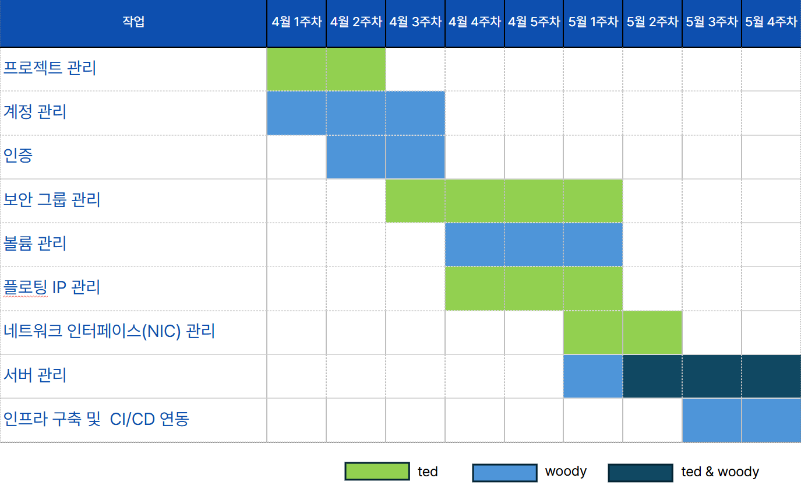
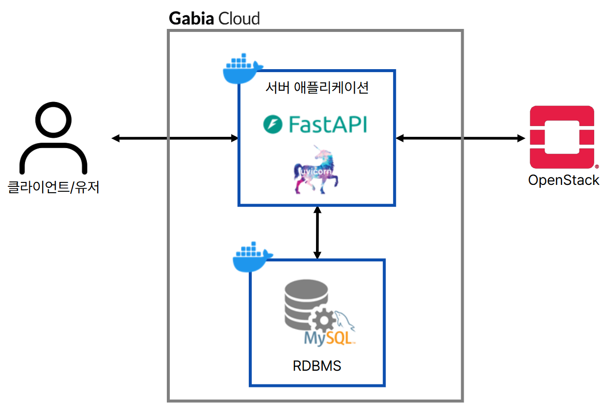
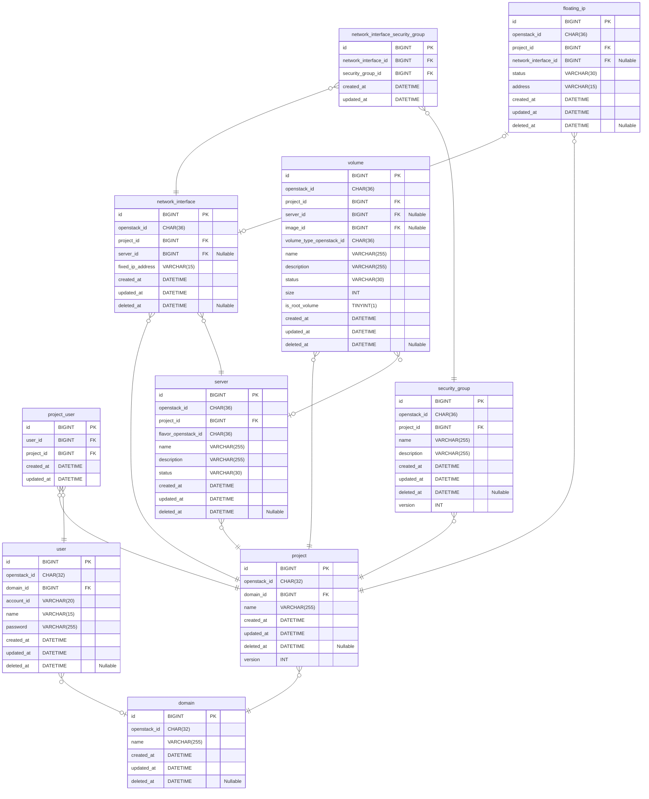

# OpenStack 기반 클라우드 서비스 제공 API 개발

---

## 📑 목차

---

[1. 프로젝트 개요](#-프로젝트-개요)

[2. 협업](#-협업)

[3. 시스템 아키텍쳐 다이어그램](#-시스템-아키텍쳐-다이어그램)

[4. 사용 기술](#-사용-기술)

[4. 프로젝트 구조](#-프로젝트-구조)

[5. ERD](#-erd)

[6. API 문서](#-api-문서)

[7. 기능 요구사항 & Sequence Diagram](#-기능-요구사항--sequence-diagram)

[8. 트러블 슈팅](#-트러블-슈팅)

## 📝 프로젝트 개요

---

본 프로젝트는 **OpenStack API**를 활용하여, 클라우드 인프라 자원을 **생성, 관리할 수 있는 백엔드 서비스를 구축**하는 것을 목표로 합니다.  
사용자는 OpenStack의 복잡한 내부 구조를 직접 이해하거나 CLI를 다루지 않고도, 본 서비스를 통해 필요한 클라우드 자원을 손쉽게 조작할 수 있습니다.

- **FastAPI 기반의 RESTful API 서버**를 개발하여, 외부 시스템 또는 사용자 인터페이스와의 통합이 용이하도록 설계하였습니다.
- 내부적으로는 OpenStack의 Nova, Neutron, Cinder, Keystone 등의 API를 활용하여, 실제 자원 생성 및 상태 관리를 자동화합니다.
- 사용자는 본 프로젝트의 API를 통해 **가상 서버 생성, 볼륨 연결, 보안 그룹 설정, Floating IP 할당 등 주요 작업을 통합된 방식으로 수행**할 수 있습니다.

## 🤝 협업

---

| 이름         | GitHub           |
|------------|------------------|
| Ted(고민영)   | [@gomin0](link)  |
| Woody(정재욱) | [@Wo-ogie](link) |



### Git Convention

- Issue
    - 기능 단위 작업 세분화
- Branch
    - Git-flow 전략
    - 모든 기능 branch 는 'develop' branch 에서 분기하여 작업
    - ex) feature/#{Issue 번호}
- Merge Request
    - Issue 단위 작업 후 MR
    - Code Review 후 'develop' branch 로 merge

## 🏗 시스템 아키텍쳐 다이어그램

---



## 🛠 사용 기술

---

- GitLab
- python3
- poetry
- fastapi
- mysql8
- pytest / unittest, testcontainers
- OpenStack

## 📁 프로젝트 구조

---

이 프로젝트는 계층형 구조(Layered Architecture)를 기반으로 설계되었으며, 구조를 크게 세 부분으로 나누어 책임을 분리하였습니다.

1. api_server: 사용자의 요청을 받는 API 레이어
2. batch_server: 배치 작업 레이어
3. common: 핵심 도메인 로직 및 인프라 연결 레이어

```
openstack-cloud-api/
├── api_server/
│   ├── router/
│   ├── exception_handler.py
│   └── main.py
│ 
├── batch_server/
│ 
├── common/
│   ├── application/
│   ├── domain/
│   ├── exception/
│   ├── infrastructure/
│   └── util/
│ 
├── docs/
│ 
└── test/
    ├── end_to_end/
    ├── unit/
    └── util/
```

## 🗃 ERD

---



## 📮 API 문서

---

링크

## 🎯 기능 요구사항 & Sequence Diagram

---

링크

## 🐛 트러블 슈팅

---
