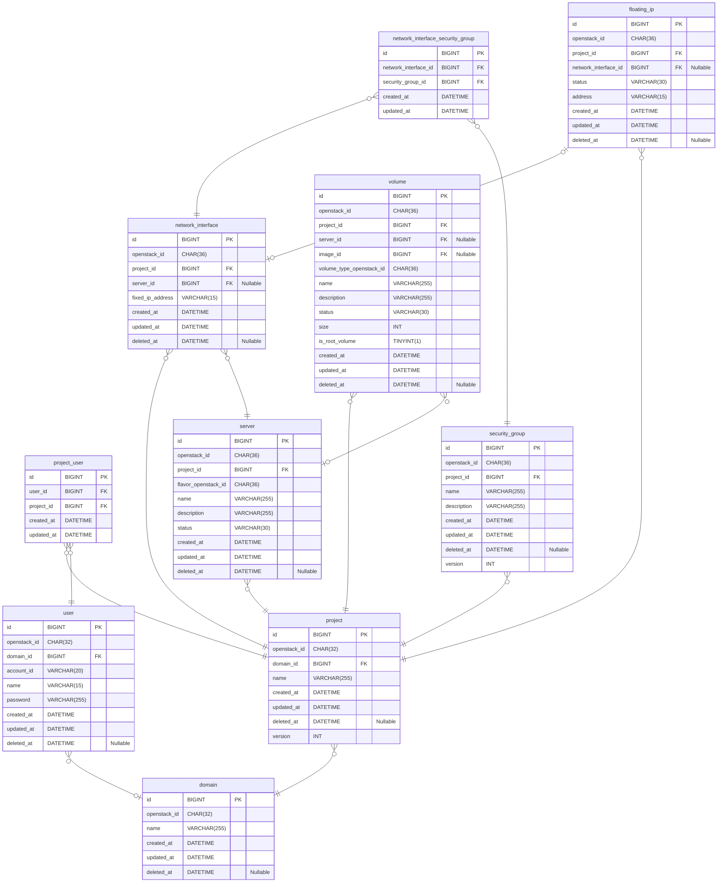

```mermaid
erDiagram
    project }o--|| domain: ""
    user }o--o| domain: ""
    project_user }o--|| project: ""
    project_user }o--|| user: ""
    network_interface }o--|| project: ""
    network_interface }o--|| server: ""
    security_group }o--|| project: ""
    network_interface_security_group }o--|| network_interface: ""
    network_interface_security_group }o--|| security_group: ""
    floating_ip |o--o| network_interface: ""
    floating_ip }o--|| project: ""
    server }o--|| project: ""
    volume }o--|| project: ""
    volume }o--o| server: ""

    domain {
        id BIGINT PK
        openstack_id CHAR(32)
        name VARCHAR(255)
        created_at DATETIME
        updated_at DATETIME
        deleted_at DATETIME "Nullable"
    }

    project {
        id BIGINT PK
        openstack_id CHAR(32)
        domain_id BIGINT FK
        name VARCHAR(255)
        created_at DATETIME
        updated_at DATETIME
        deleted_at DATETIME "Nullable"
        version INT
    }

    user {
        id BIGINT PK
        openstack_id CHAR(32)
        domain_id BIGINT FK
        account_id VARCHAR(20)
        name VARCHAR(15)
        password VARCHAR(255)
        created_at DATETIME
        updated_at DATETIME
        deleted_at DATETIME "Nullable"
    }

    project_user {
        id BIGINT PK
        user_id BIGINT FK
        project_id BIGINT FK
        created_at DATETIME
        updated_at DATETIME
    }

    server {
        id BIGINT PK
        openstack_id CHAR(36)
        project_id BIGINT FK
        flavor_openstack_id CHAR(36)
        name VARCHAR(255)
        description VARCHAR(255)
        status VARCHAR(30)
        created_at DATETIME
        updated_at DATETIME
        deleted_at DATETIME "Nullable"
    }

    network_interface {
        id BIGINT PK
        openstack_id CHAR(36)
        project_id BIGINT FK
        server_id BIGINT FK "Nullable"
        fixed_ip_address VARCHAR(15)
        created_at DATETIME
        updated_at DATETIME
        deleted_at DATETIME "Nullable"
    }

    volume {
        id BIGINT PK
        openstack_id CHAR(36)
        project_id BIGINT FK
        server_id BIGINT FK "Nullable"
        image_id BIGINT FK "Nullable"
        volume_type_openstack_id CHAR(36)
        name VARCHAR(255)
        description VARCHAR(255)
        status VARCHAR(30)
        size INT
        is_root_volume TINYINT(1)
        created_at DATETIME
        updated_at DATETIME
        deleted_at DATETIME "Nullable"
    }

    security_group {
        id BIGINT PK
        openstack_id CHAR(36)
        project_id BIGINT FK
        name VARCHAR(255)
        description VARCHAR(255)
        created_at DATETIME
        updated_at DATETIME
        deleted_at DATETIME "Nullable"
        version INT
    }

    network_interface_security_group {
        id BIGINT PK
        network_interface_id BIGINT FK
        security_group_id BIGINT FK
        created_at DATETIME
        updated_at DATETIME
    }

    floating_ip {
        id BIGINT PK
        openstack_id CHAR(36)
        project_id BIGINT FK
        network_interface_id BIGINT FK "Nullable"
        status VARCHAR(30)
        address VARCHAR(15)
        created_at DATETIME
        updated_at DATETIME
        deleted_at DATETIME "Nullable"
    }
```