# 계정 관리

## **컨셉**

- 계정을 생성/삭제 할 수 있다.
- 프로젝트 내 계정을 포함/제외 할 수 있다.
- ID / Password 를 기반으로 인증을 제공한다.
- 도메인과 프로젝트는 미리 생성하여 제공된 것을 사용한다.

## **프로젝트**

### 프로젝트 목록을 조회할 수 있다.

- 검색 조건
    - 프로젝트 ID (equal, in, not)
    - 프로젝트 이름 (equal, like)
- 정렬 조건
    - 이름
    - 생성일
- 응답에는 반드시 다음 값이 필요하다.
    - 프로젝트 ID
    - 프로젝트 이름
    - 프로젝트가 속한 도메인 정보
        - 도메인 ID
        - 도메인 이름
    - 프로젝트에 속한 계정 목록
        - 계정 ID
        - 계정 로그인 ID
        - 계정 이름
    - 생성일
    - 수정일
    - 삭제일

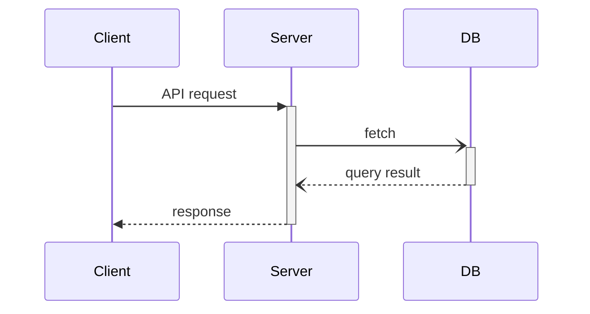

### 프로젝트를 단일 조회할 수 있다.

- 응답에는 반드시 다음 값이 필요하다.
    - 프로젝트 ID
    - 프로젝트 이름
    - 프로젝트가 속한 도메인 정보
        - 도메인 ID
        - 도메인 이름
    - 프로젝트에 속한 계정 목록
        - 계정 ID
        - 계정 로그인 ID
        - 계정 이름
    - 생성일
    - 수정일
    - 삭제일

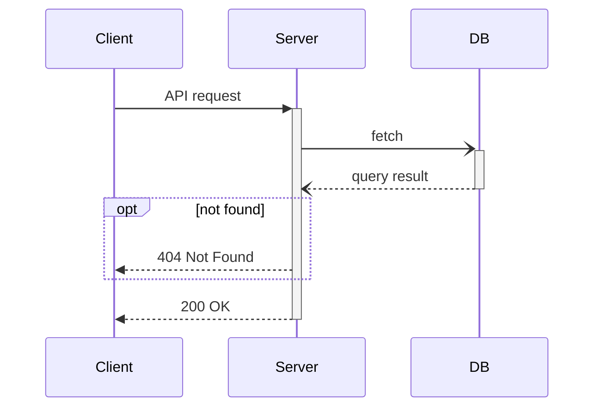

### 프로젝트를 변경할 수 있다.

- 다음 조건을 만족해야 한다.
    - 다른 프로젝트와 이름을 중복할 수 없다.

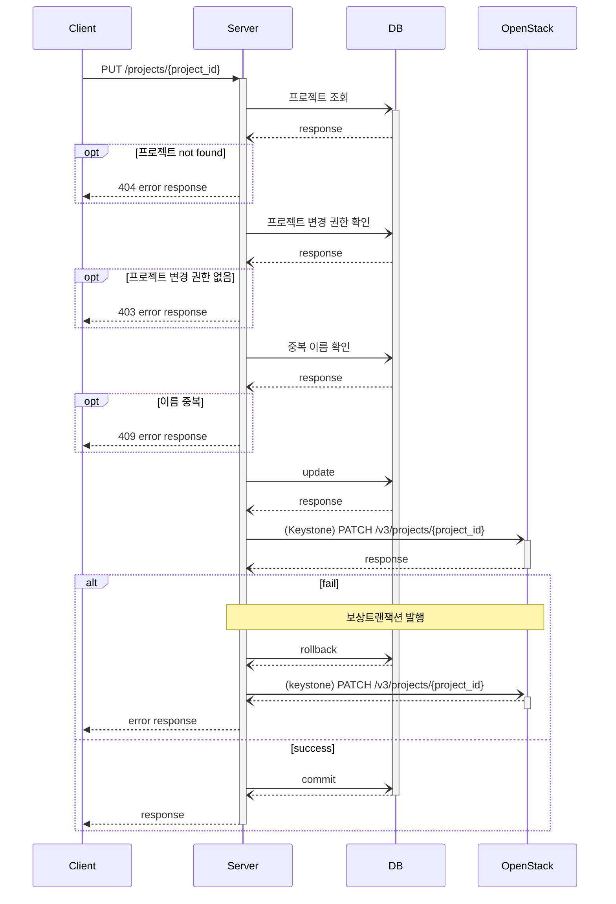

### 프로젝트에 계정을 소속시킬 수 있다.

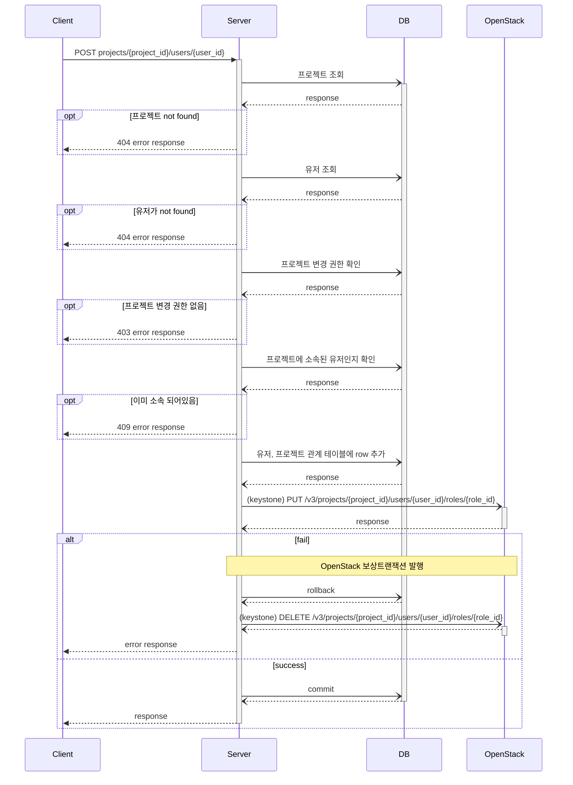

### 프로젝트에서 계정을 제외시킬 수 있다.

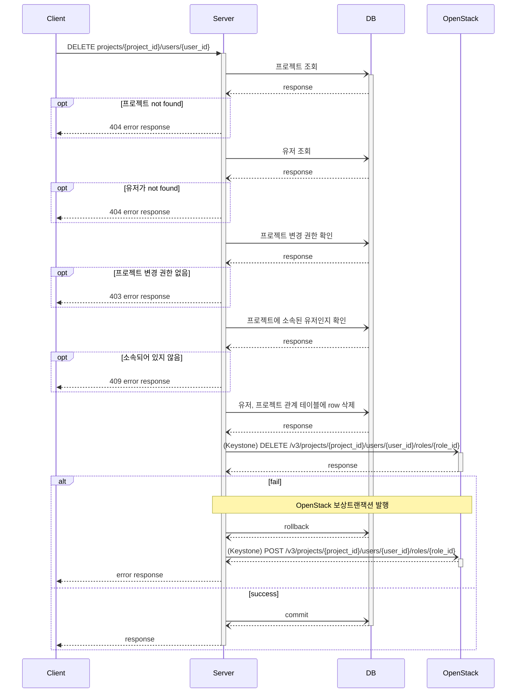

## **계정**

### 계정 목록을 조회할 수 있다.

- 검색 조건
    - 계정 ID
    - 로그인 ID
    - 계정 이름
- 정렬 조건
    - 가입일
    - 로그인 ID
    - 계정 이름
- 응답에는 반드시 다음 값이 필요하다.
    - 계정 ID
    - 로그인 ID
    - 계정 이름
    - 계정이 속한 프로젝트 목록
        - 프로젝트 ID
        - 프로젝트 이름
    - 계정이 속한 도메인 정보
        - 도메인 ID
        - 도메인 이름
    - 생성일
    - 수정일
    - 삭제일

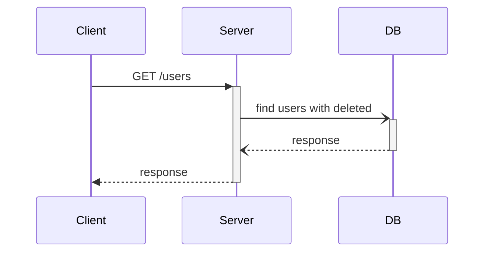

### 계정을 단일 조회할 수 있다.

- 응답에는 반드시 다음 값이 필요하다.
    - 계정 ID
    - 로그인 ID
    - 계정 이름
    - 계정이 속한 프로젝트 목록
        - 프로젝트 ID
        - 프로젝트 이름
    - 계정이 속한 도메인 정보
        - 도메인 ID
        - 도메인 이름
    - 생성일
    - 수정일
    - 삭제일

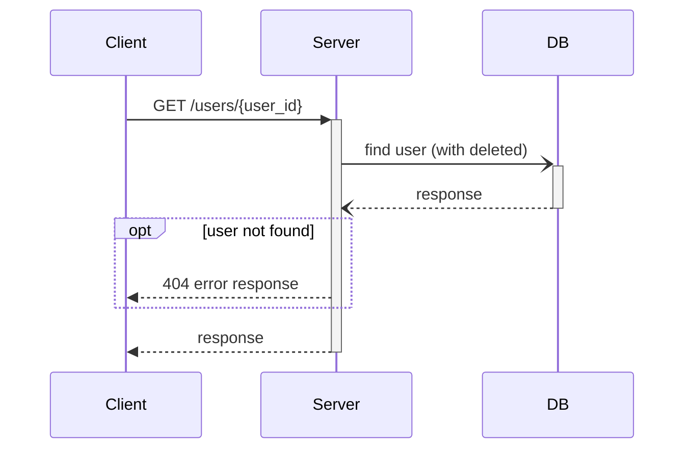

### 회원 가입을 할 수 있다.

- 로그인 ID 는 전체 계정에서 중복할 수 없다.

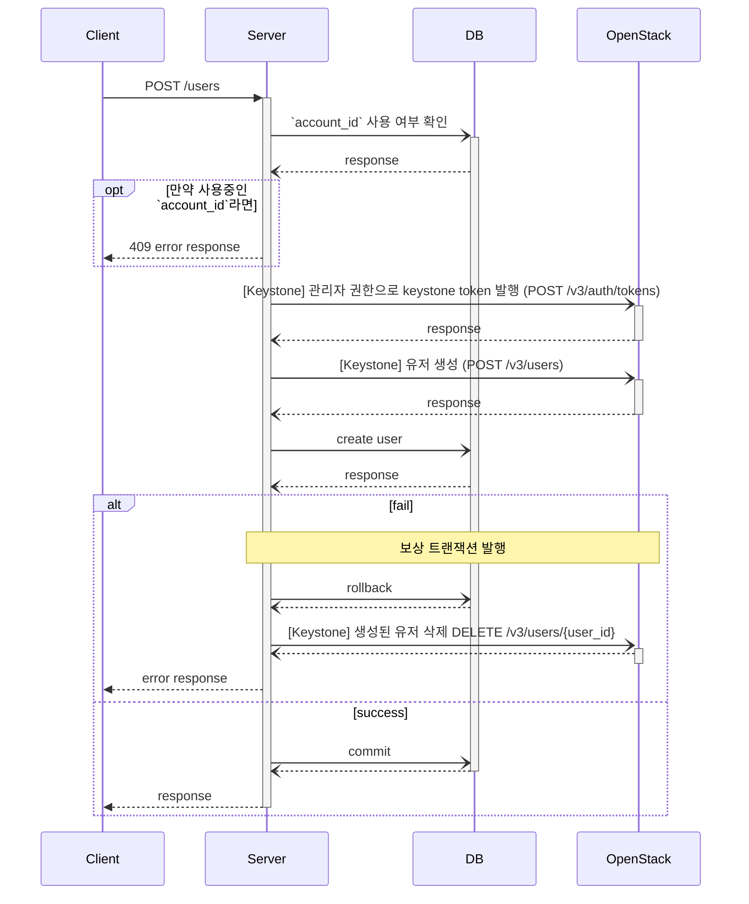

### 유저 정보를 변경할 수 있다.

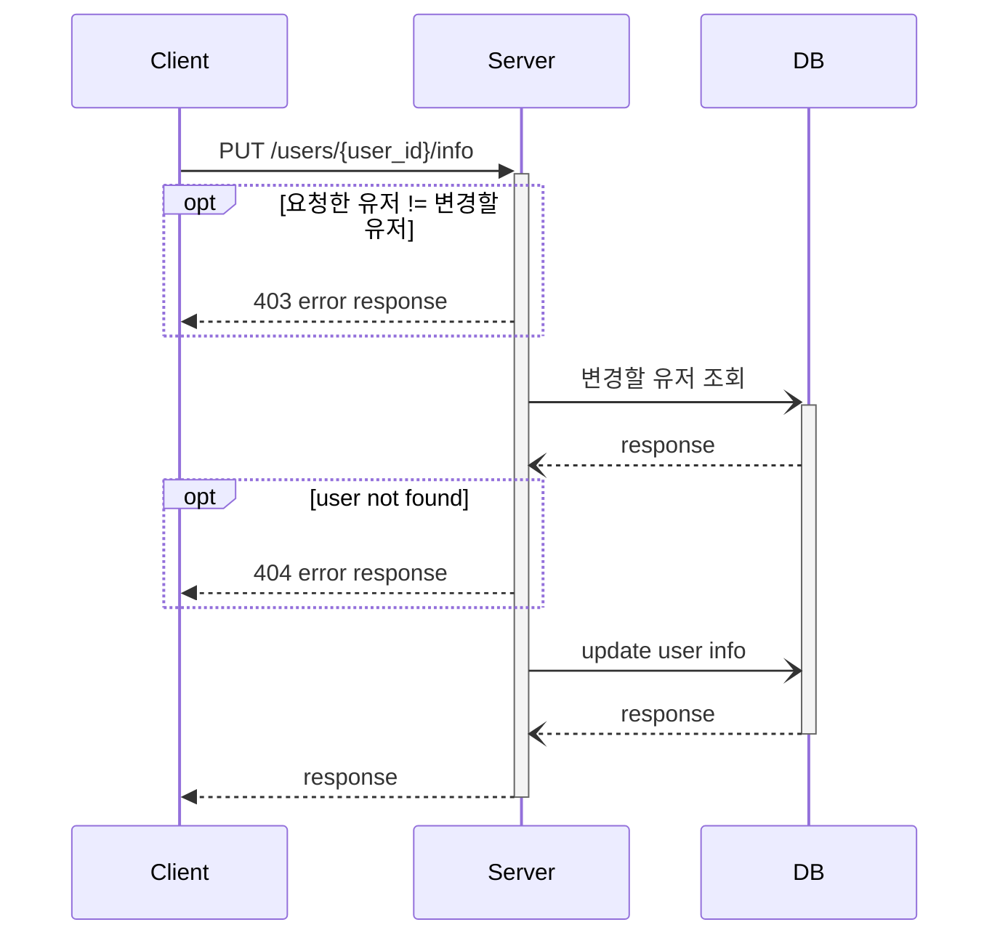

### 회원 탈퇴가 가능해야 한다.

- 마지막 남은 계정은 삭제할 수 없다.

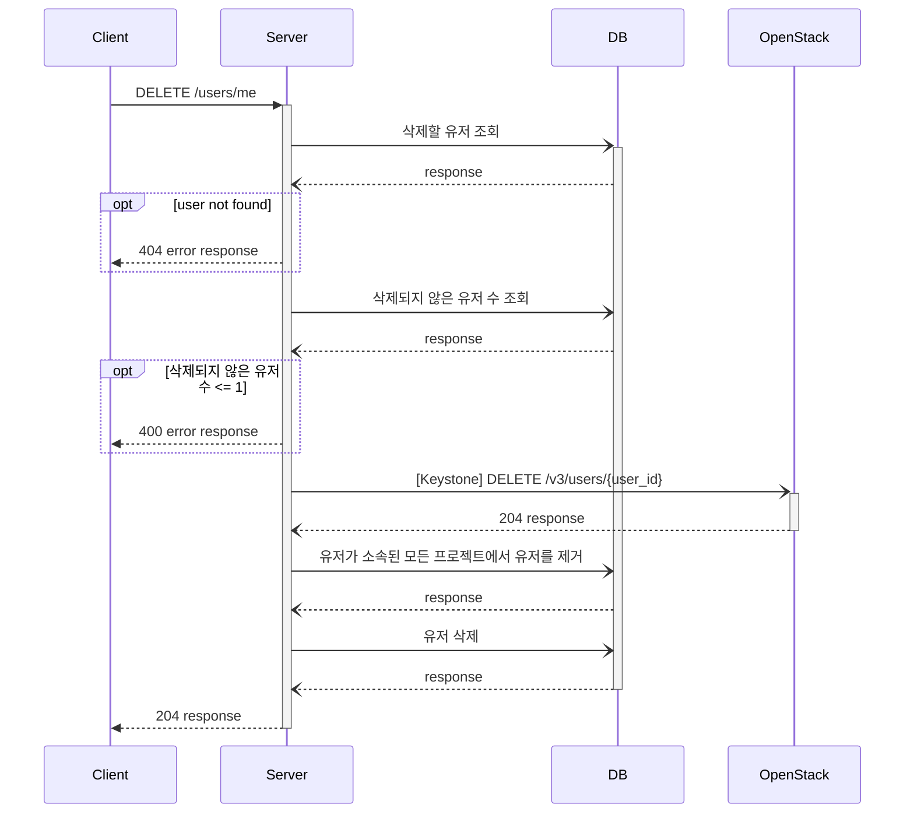

## **인증**

### id/password 로그인을 제공한다.

- 자신이 속한 프로젝트에만 로그인할 수 있다.
- 프로젝트 ID 를 제공받아 명시적으로 로그인 프로젝트를 지정할 수 있다.
- 프로젝트 ID 가 없으면 자동으로 프로젝트 하나를 지정해 로그인한다.
- 어떠한 프로젝트에도 속하지 않은 계정은 로그인 할 수 없다.

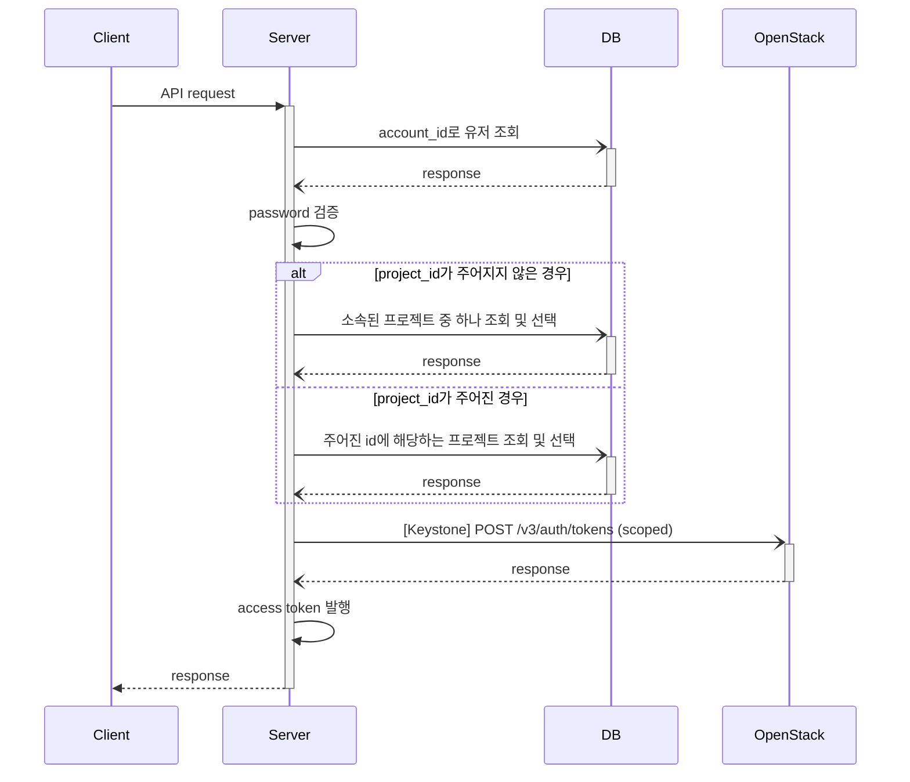

