# 자원 관리

## **컨셉**

- 프로젝트 내에서 openstack api를 활용하여 자원을 관리할 수 있다.
- api를 통해 다뤄야 할 자원은 서버, 볼륨, 플로팅 IP, 보안그룹이다. 그 외의 자원은 다루지 않아도 된다.

## **서버(인스턴스)**

### 소유한 서버 목록을 조회할 수 있으며 다음 검색 조건과 정렬 조건을 제공해야 한다.

- 검색 조건
    - ID(equal, in, not)
    - 이름(equal, like)
- 정렬 조건
    - 이름
    - 생성일
- 응답에는 반드시 다음 값이 필요하다.
    - ID
    - 이름
    - 설명
    - 프로젝트 ID
    - 사양
    - 이미지 ID, 이름
    - 운영 상태
    - 고정 IP 주소
    - 연관 자원 정보
        - 플로팅 IP ID, 주소
        - 연결된 볼륨 ID, 이름, 타입, 용량
        - 설정한 보안 그룹 ID, 이름
    - 생성일
    - 변경일
    - 삭제일

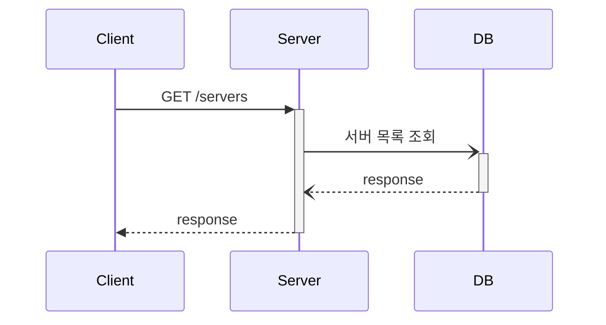
```mermaid
sequenceDiagram
    participant c as Client
    participant s as Server
    participant db as DB
    c ->>+ s: GET /servers
    s -)+ db: 서버 목록 조회
    db --)- s: response
    s -->>- c: response
```

### 단일 서버를 조회할 수 있어야 한다.

- 응답에는 반드시 다음 값이 필요하다.
    - ID
    - 이름
    - 설명
    - 프로젝트 ID
    - 사양
    - 이미지 ID, 이름
    - 운영 상태
    - 고정 IP 주소
    - 연관 자원 정보
        - 플로팅 IP ID, 주소
        - 연결된 볼륨 ID, 이름, 타입, 용량
        - 설정한 보안 그룹 ID, 이름
    - 생성일
    - 변경일
    - 삭제일

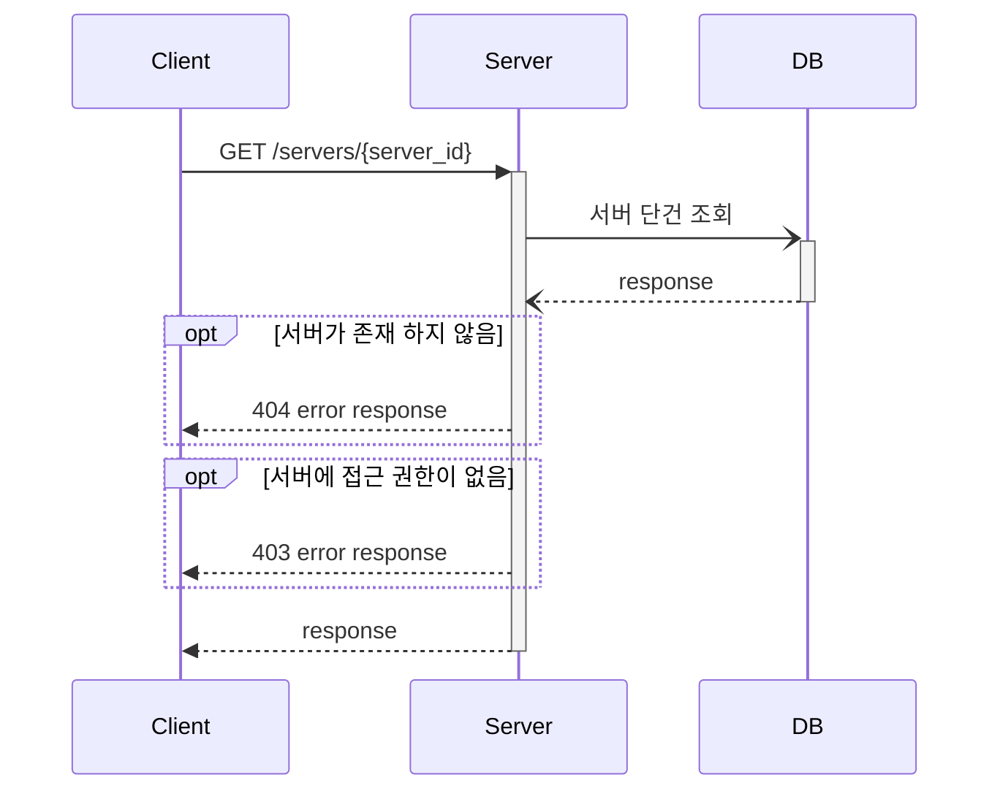
```mermaid
sequenceDiagram
    participant c as Client
    participant s as Server
    participant db as DB
    c ->>+ s: GET /servers/{server_id}
    s -)+ db: 서버 단건 조회
    db --)- s: response

    opt 서버가 존재 하지 않음
        s -->> c: 404 error response
    end
    opt 서버에 접근 권한이 없음
        s -->> c: 403 error response
    end

    s -->>- c: response
```

### 서버를 생성할 수 있어야 한다.

- 다음을 만족해야 한다.
    - 서버 이름은 프로젝트 내 삭제되지 않은 다른 서버 이름과 중복해서 생성할 수 없다.
    - 사양은 사전에 제공 받은 flavor 중 하나를 선택해서 생성한다.
    - 사전에 제공 받은 네트워크와 서브넷을 선택해서 생성한다.
    - 서버 생성 시, 루트 볼륨을 생성해야 한다.
        - 루트 볼륨 타입은 __DEFAULT__로 고정한다.
        - 이미지는 사전 제공 받은 이미지 중 하나를 선택 할 수 있어야 한다.
    - 보안 그룹을 여러 개 선택할 수 있다.
    - 로그인 방법은 비밀번호 방식으로 통일한다.
- OpenStack 관련 내용 정리
    - 서버 생성 시 초기에 `BUILD` 상태로 생성됨
    - 함께 생성하는 루트 볼륨의 상태 변화는 다음과 같음
        - `creating` → `downloading` → `available` → `reserved` → `attaching` → `in_use`
    - 루트 볼륨의 상태가 `in_use`가 되고부터 “Show server detail” API의 response의 `"os-extended-volumes:volumes_attached"` 항목이 채워짐
    - 위의 작업들을 포함한 서버 생성이 완료되면 서버의 상태가 `ACTIVE`로 변경됨
    - 에러 발생 시, 서버는 `ERROR` 상태로 변경됨

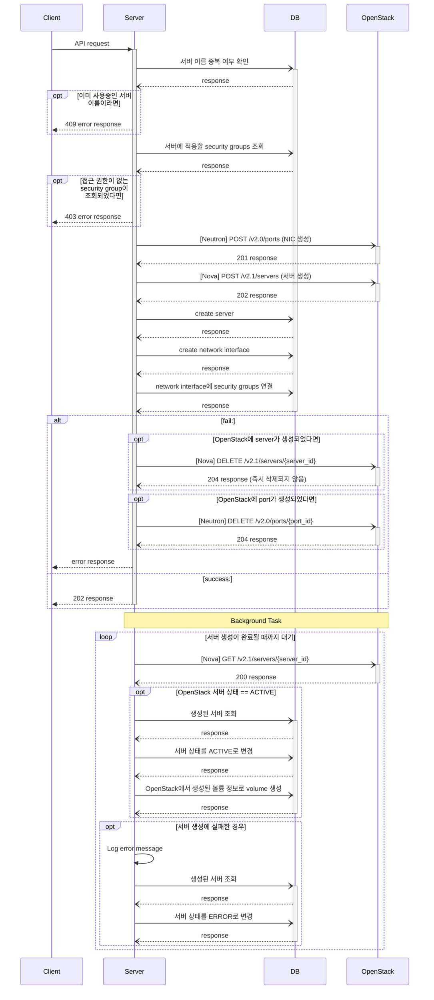
```mermaid
sequenceDiagram
    participant c as Client
    participant s as Server
    participant db as DB
    participant os as OpenStack
    c ->>+ s: API request
    s -)+ db: 서버 이름 중복 여부 확인
    db --) s: response
    opt 이미 사용중인 서버 이름이라면
        s -->> c: 409 error response
    end

    s -) db: 서버에 적용할 security groups 조회
    db --) s: response
    opt 접근 권한이 없는 security group이 조회되었다면
        s -->> c: 403 error response
    end

    s -)+ os: [Neutron] POST /v2.0/ports (NIC 생성)
    os --)- s: 201 response
    s -)+ os: [Nova] POST /v2.1/servers (서버 생성)
    os --)- s: 202 response
    s -) db: create server
    db --) s: response
    s -) db: create network interface
    db --) s: response
    s -) db: network interface에 security groups 연결
    db --)- s: response

    alt fail:
        opt OpenStack에 server가 생성되었다면
            s -)+ os: [Nova] DELETE /v2.1/servers/{server_id}
            os --)- s: 204 response (즉시 삭제되지 않음)
        end
        opt OpenStack에 port가 생성되었다면
            s -)+ os: [Neutron] DELETE /v2.0/ports/{port_id}
            os --)- s: 204 response
        end
        s -->> c: error response
    else success:
        s -->>- c: 202 response
    end

    note over s, os: Background Task
    loop 서버 생성이 완료될 때까지 대기
        s -)+ os: [Nova] GET /v2.1/servers/{server_id}
        os --)- s: 200 response

        opt OpenStack 서버 상태 == ACTIVE
            s -)+ db: 생성된 서버 조회
            db --) s: response
            s -) db: 서버 상태를 ACTIVE로 변경
            db --) s: response
            s -) db: OpenStack에서 생성된 볼륨 정보로 volume 생성
            db --)- s: response
        end

        opt 서버 생성에 실패한 경우
            s ->> s: Log error message
            s -)+ db: 생성된 서버 조회
            db --) s: response
            s -) db: 서버 상태를 ERROR로 변경
            db --)- s: response
        end
    end
```

### 서버 정보를 변경할 수 있어야 한다.

- 다음을 만족해야 한다.
    - 서버 이름과 설명을 변경할 수 있다.
    - 서버 이름은 자신이 소유한 다른 서버 이름과 중복할 수 없다.

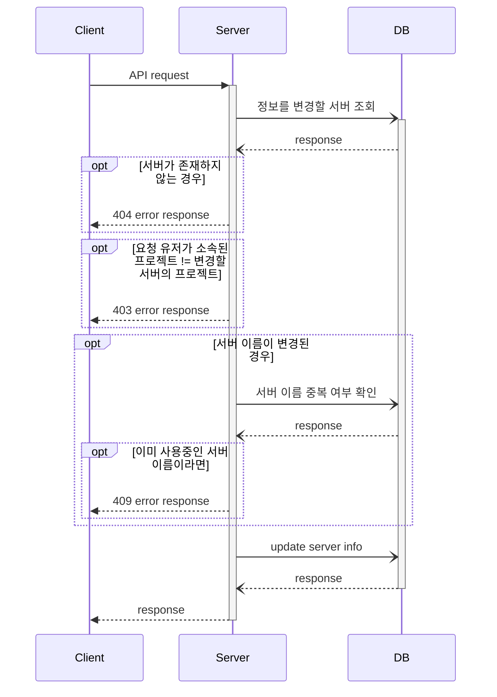
```mermaid
sequenceDiagram
    participant c as Client
    participant s as Server
    participant db as DB
    c ->>+ s: API request
    s -)+ db: 정보를 변경할 서버 조회
    db --) s: response

    opt 서버가 존재하지 않는 경우
        s -->> c: 404 error response
    end

    opt 요청 유저가 소속된 프로젝트 != 변경할 서버의 프로젝트
        s -->> c: 403 error response
    end

    opt 서버 이름이 변경된 경우
        s -) db: 서버 이름 중복 여부 확인
        db --) s: response
        opt 이미 사용중인 서버 이름이라면
            s -->> c: 409 error response
        end
    end

    s -) db: update server info
    db --)- s: response
    s -->>- c: response
```

### 서버를 삭제할 수 있어야 한다.

- 다음을 만족해야 한다.
    - 서버는 삭제 가능한 상태에서만 삭제할 수 있다.
    - 서버 삭제 시 네트워크 인터페이스(NIC)는 자동으로 삭제한다.
    - 서버 삭제 시 루트 볼륨은 자동으로 삭제한다.
    - 서버 삭제 시 추가 볼륨은 연결 해제한다.
    - 서버 삭제 시 플로팅 IP 는 연결 해제 한다.
    - 서버 삭제 시 보안 그룹은 연결 해제 한다.
- Openstack
    - 서버는 `locked` 상태가 아닌 경우에 삭제 가능하다.
    - 삭제된 서버는 `DELETED` 상태로 변하며, 이후 완전히 삭제가 되면 조회되지 않는다.
    - 서버 생성 시 같이 생성한 볼륨에 대해 `delete_on_termination`를 `true`로 했을 경우
        - `in_use` 상태인 볼륨을 연결 해제하여 `available` 상태로 변경시킨 후
        - 볼륨은 `deleting` 상태가 되었다가 완전히 삭제된다.

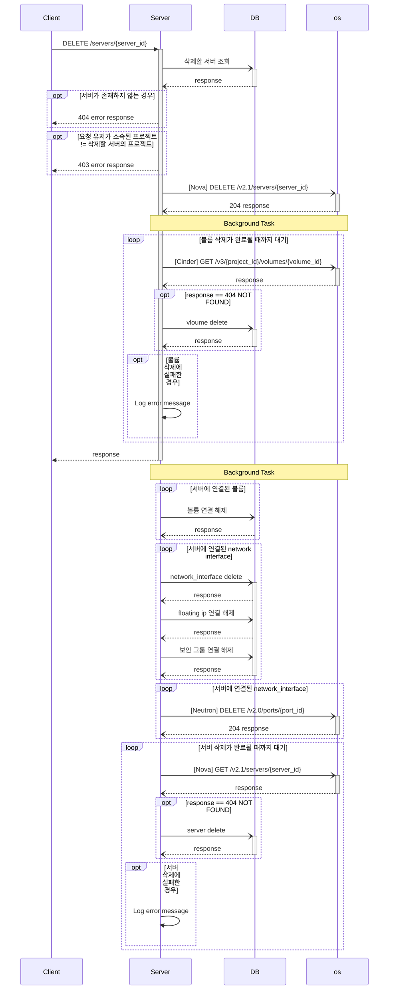
```mermaid
sequenceDiagram
    participant c as Client
    participant s as Server
    participant db as DB
    c ->>+ s: DELETE /servers/{server_id}
    s -)+ db: 삭제할 서버 조회
    db --)- s: response

    opt 서버가 존재하지 않는 경우
        s -->> c: 404 error response
    end

    opt 요청 유저가 소속된 프로젝트 != 삭제할 서버의 프로젝트
        s -->> c: 403 error response
    end

    s -)+ os: [Nova] DELETE /v2.1/servers/{server_id}
    os --)- s: 204 response
    note over s, os: Background Task
    loop 볼륨 삭제가 완료될 때까지 대기
        s -)+ os: [Cinder] GET /v3/{project_Id}/volumes/{volume_id}
        os --)- s: response

        opt response == 404 NOT FOUND
            s -)+ db: vloume delete
            db --)- s: response
        end

        opt 볼륨 삭제에 실패한 경우
            s ->> s: Log error message
        end
    end

    s -->>- c: response
    note over s, os: Background Task
    loop 서버에 연결된 볼륨
        s -) db: 볼륨 연결 해제
        db --) s: response
    end
    loop 서버에 연결된 network interface
        s -)+ db: network_interface delete
        db --) s: response
        s -) db: floating ip 연결 해제
        db --) s: response
        s -) db: 보안 그룹 연결 해제
        db --)- s: response
    end

    loop 서버에 연결된 network_interface
        s -)+ os: [Neutron] DELETE /v2.0/ports/{port_id}
        os --)- s: 204 response
    end
    loop 서버 삭제가 완료될 때까지 대기
        s -)+ os: [Nova] GET /v2.1/servers/{server_id}
        os --)- s: response

        opt response == 404 NOT FOUND
            s -)+ db: server delete
            db --)- s: response
        end

        opt 서버 삭제에 실패한 경우
            s ->> s: Log error message
        end
    end
```

### 서버 상태를 변경할 수 있어야 한다.

- 시작/정지를 할 수 있다.

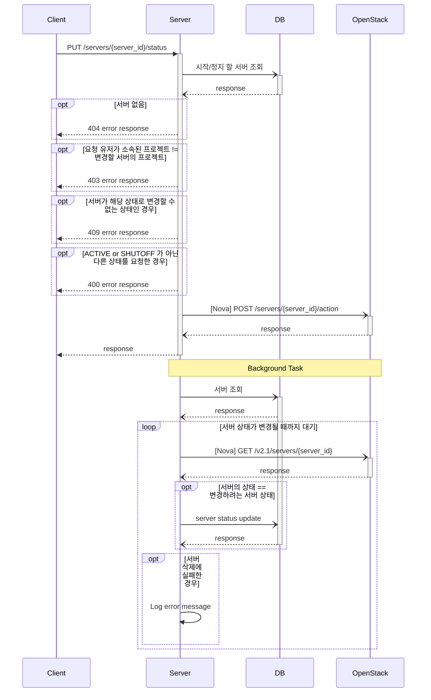
```mermaid
sequenceDiagram
    participant c as Client
    participant s as Server
    participant db as DB
    participant os as OpenStack
    c ->>+ s: PUT /servers/{server_id}/status
    s -)+ db: 시작/정지 할 서버 조회
    db --)- s: response
    opt 서버 없음
        s -->> c: 404 error response
    end
    opt 요청 유저가 소속된 프로젝트 != 변경할 서버의 프로젝트
        s -->> c: 403 error response
    end

    opt 서버가 해당 상태로 변경할 수 없는 상태인 경우
        s -->> c: 409 error response
    end
    opt ACTIVE or SHUTOFF 가 아닌 다른 상태를 요청한 경우
        s -->> c: 400 error response
    end

    s -)+ os: [Nova] POST /servers/{server_id}/action
    os --)- s: response
    s -->>- c: response
    note over s, os: Background Task
    s -)+ db: 서버 조회
    db --) s: response
    loop 서버 상태가 변경될 때까지 대기
        s -)+ os: [Nova] GET /v2.1/servers/{server_id}
        os --)- s: response

        opt 서버의 상태 == 변경하려는 서버 상태
            s -) db: server status update
            db --)- s: response
        end

        opt 서버 삭제에 실패한 경우
            s ->> s: Log error message
        end
    end
```

### 서버를 VNC 기능을 이용해 접속해볼 수 있어야 한다.

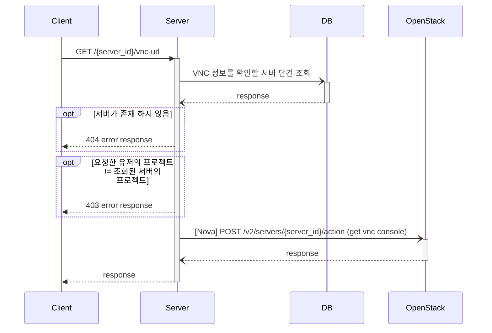
```mermaid
sequenceDiagram
    participant c as Client
    participant s as Server
    participant db as DB
    participant os as OpenStack
    c ->>+ s: GET /{server_id}/vnc-url
    s -)+ db: VNC 정보를 확인할 서버 단건 조회
    db --)- s: response

    opt 서버가 존재 하지 않음
        s -->> c: 404 error response
    end
    opt 요청한 유저의 프로젝트 != 조회된 서버의 프로젝트
        s -->> c: 403 error response
    end

    s -)+ os: [Nova] POST /v2/servers/{server_id}/action (get vnc console)
    os --)- s: response
    s -->>- c: response

```

### 서버에 볼륨을 연결할 수 있어야 한다.

- 연결 완료 이후에 확인이 가능해야 한다.
- Openstack
    - 볼륨 연결 API(Cinder)의 response code는 `200`
    - 볼륨 상태는 `available`→ `reserved` → `attaching` → `in-use`로 변화한다.

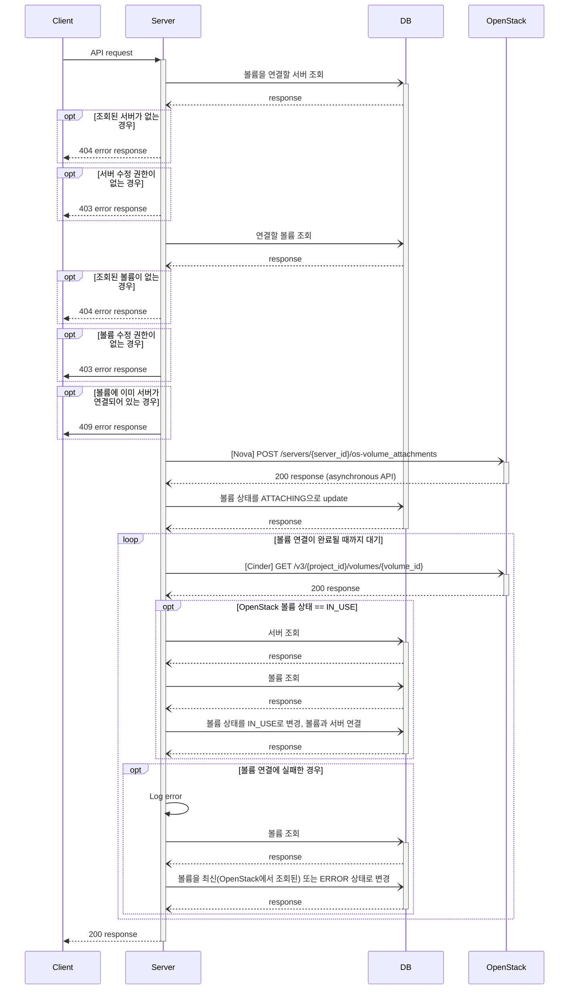
```mermaid
sequenceDiagram
    participant c as Client
    participant s as Server
    participant db as DB
    participant os as OpenStack
    c ->>+ s: API request
    s -)+ db: 볼륨을 연결할 서버 조회
    db --) s: response
    opt 조회된 서버가 없는 경우
        s -->> c: 404 error response
    end
    opt 서버 수정 권한이 없는 경우
        s -->> c: 403 error response
    end

    s -) db: 연결할 볼륨 조회
    db --) s: response
    opt 조회된 볼륨이 없는 경우
        s -->> c: 404 error response
    end
    opt 볼륨 수정 권한이 없는 경우
        s ->> c: 403 error response
    end
    opt 볼륨에 이미 서버가 연결되어 있는 경우
        s ->> c: 409 error response
    end

    s -)+ os: [Nova] POST /servers/{server_id}/os-volume_attachments
    os --)- s: 200 response (asynchronous API)
    s -) db: 볼륨 상태를 ATTACHING으로 update
    db --)- s: response

    loop 볼륨 연결이 완료될 때까지 대기
        s -)+ os: [Cinder] GET /v3/{project_id}/volumes/{volume_id}
        os --)- s: 200 response

        opt OpenStack 볼륨 상태 == IN_USE
            s -)+ db: 서버 조회
            db --) s: response
            s -) db: 볼륨 조회
            db --) s: response
            s -) db: 볼륨 상태를 IN_USE로 변경, 볼륨과 서버 연결
            db --)- s: response
        end

        opt 볼륨 연결에 실패한 경우
            s ->> s: Log error
            s -)+ db: 볼륨 조회
            db --) s: response
            s -) db: 볼륨을 최신(OpenStack에서 조회된) 또는 ERROR 상태로 변경
            db --)- s: response
        end
    end

    s -->>- c: 200 response
```

### 서버에 볼륨을 해제할 수 있어야 한다.

- 해제 완료 이후에 확인이 가능해야한다.
- Openstack
    - 볼륨 해제의 경우 response code 202 볼륨 상태는 `in-use` → `detaching` → `available`

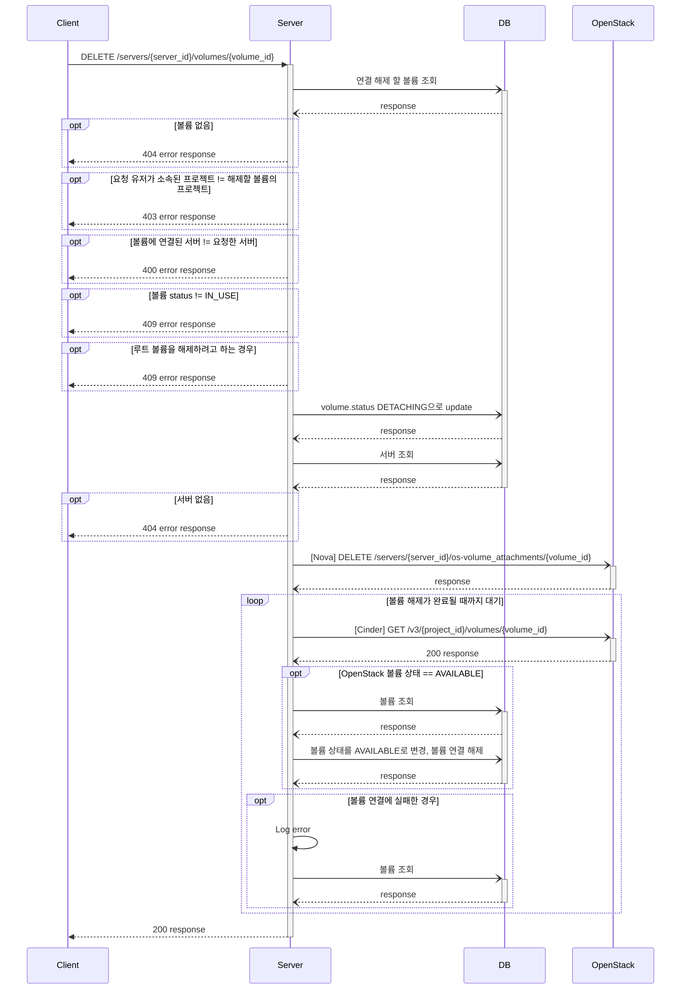
```mermaid
sequenceDiagram
    participant c as Client
    participant s as Server
    participant db as DB
    participant os as OpenStack
    c ->>+ s: DELETE /servers/{server_id}/volumes/{volume_id}
    s -)+ db: 연결 해제 할 볼륨 조회
    db --) s: response

    opt 볼륨 없음
        s -->> c: 404 error response
    end

    opt 요청 유저가 소속된 프로젝트 != 해제할 볼륨의 프로젝트
        s -->> c: 403 error response
    end
    opt 볼륨에 연결된 서버 != 요청한 서버
        s -->> c: 400 error response
    end
    opt 볼륨 status != IN_USE
        s -->> c: 409 error response
    end
    opt 루트 볼륨을 해제하려고 하는 경우
        s -->> c: 409 error response
    end
    s -) db: volume.status DETACHING으로 update
    db --) s: response
    s -) db: 서버 조회
    db --)- s: response
    opt 서버 없음
        s -->> c: 404 error response
    end

    s -)+ os: [Nova] DELETE /servers/{server_id}/os-volume_attachments/{volume_id}
    os --)- s: response

    loop 볼륨 해제가 완료될 때까지 대기
        s -)+ os: [Cinder] GET /v3/{project_id}/volumes/{volume_id}
        os --)- s: 200 response

        opt OpenStack 볼륨 상태 == AVAILABLE
            s -)+ db: 볼륨 조회
            db --) s: response
            s -) db: 볼륨 상태를 AVAILABLE로 변경, 볼륨 연결 해제
            db --)- s: response
        end

        opt 볼륨 연결에 실패한 경우
            s ->> s: Log error
            s -)+ db: 볼륨 조회
            db --)- s: response
        end
    end

    s -->>- c: 200 response
```

### 서버에 플로팅 IP 를 연결할 수 있어야 한다.

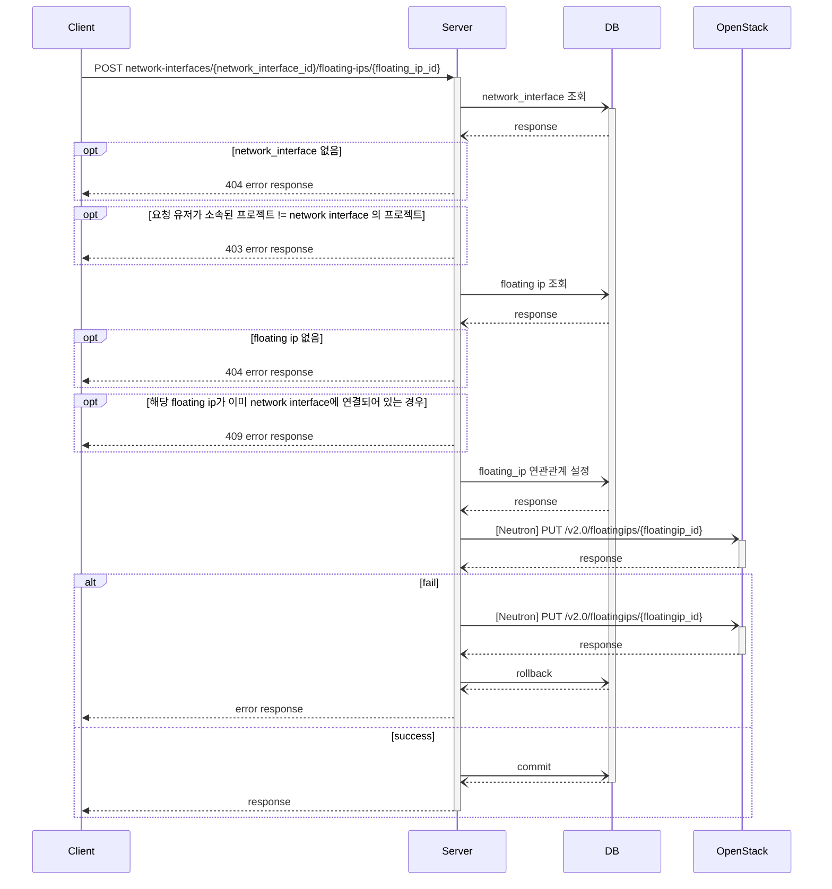
```mermaid
sequenceDiagram
    participant c as Client
    participant s as Server
    participant db as DB
    participant neutron as OpenStack
    c ->>+ s: POST network-interfaces/{network_interface_id}/floating-ips/{floating_ip_id}
    s -)+ db: network_interface 조회
    db --) s: response
    opt network_interface 없음
        s -->> c: 404 error response
    end
    opt 요청 유저가 소속된 프로젝트 != network interface 의 프로젝트
        s -->> c: 403 error response
    end

    s -) db: floating ip 조회
    db --) s: response
    opt floating ip 없음
        s -->> c: 404 error response
    end
    opt 해당 floating ip가 이미 network interface에 연결되어 있는 경우
        s -->> c: 409 error response
    end

    s -) db: floating_ip 연관관계 설정
    db --) s: response
    s -)+ neutron: [Neutron] PUT /v2.0/floatingips/{floatingip_id}
    neutron --)- s: response

alt fail
s-)+neutron: [Neutron] PUT /v2.0/floatingips/{floatingip_id}
neutron--)-s: response
s-)db: rollback
db--)s: 
          s-->>c: error response
else success
s-)db: commit
db--)-s:
s-->>-c: response
end
```

### 서버에 플로팅 IP 를 연결 해제할 수 있어야 한다.

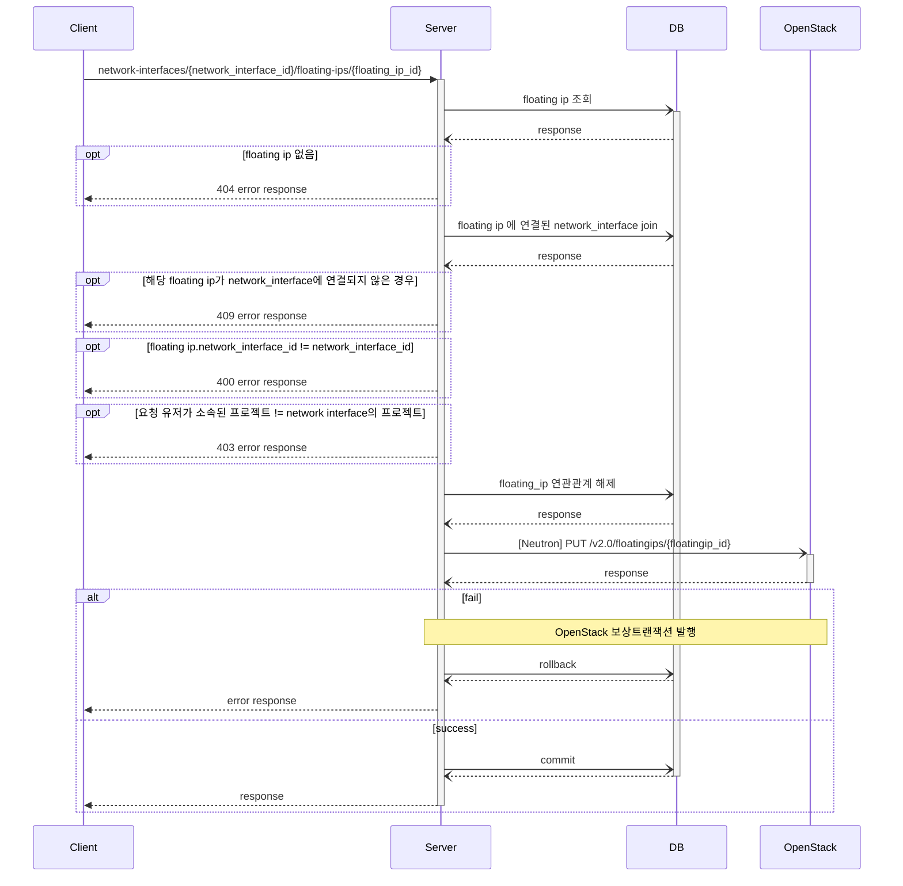
```mermaid
sequenceDiagram
    participant c as Client
    participant s as Server
    participant db as DB
    participant neutron as OpenStack
    c ->>+ s: network-interfaces/{network_interface_id}/floating-ips/{floating_ip_id}
    s -)+ db: floating ip 조회
    db --) s: response
    opt floating ip 없음
        s -->> c: 404 error response
    end

    s -) db: floating ip 에 연결된 network_interface join
    db --) s: response
    opt 해당 floating ip가 network_interface에 연결되지 않은 경우
        s -->> c: 409 error response
    end
    opt floating ip.network_interface_id != network_interface_id
        s -->> c: 400 error response
    end
    opt 요청 유저가 소속된 프로젝트 != network interface의 프로젝트
        s -->> c: 403 error response
    end

    s -) db: floating_ip 연관관계 해제
    db --) s: response
    s -)+ neutron: [Neutron] PUT /v2.0/floatingips/{floatingip_id}
    neutron --)- s: response

alt fail
Note over s, neutron: OpenStack 보상트랜잭션 발행
s-)db: rollback
db--)s: 
          s-->>c: error response
else success
s-)db: commit
db--)-s:
s-->>-c: response
end
```

## **볼륨**

### 소유한 볼륨 목록을 조회할 수 있다.

- 다음 조건을 만족해야 한다.
    - 정렬 조건
        - 이름
        - 생성일
- 응답에는 반드시 다음 값이 필요하다.
    - ID
    - 이름
    - 설명
    - 프로젝트 ID
    - 볼륨 타입
    - 용량
    - 상태
    - 연결된 서버 ID, 이름
    - 생성일
    - 변경일
    - 삭제일

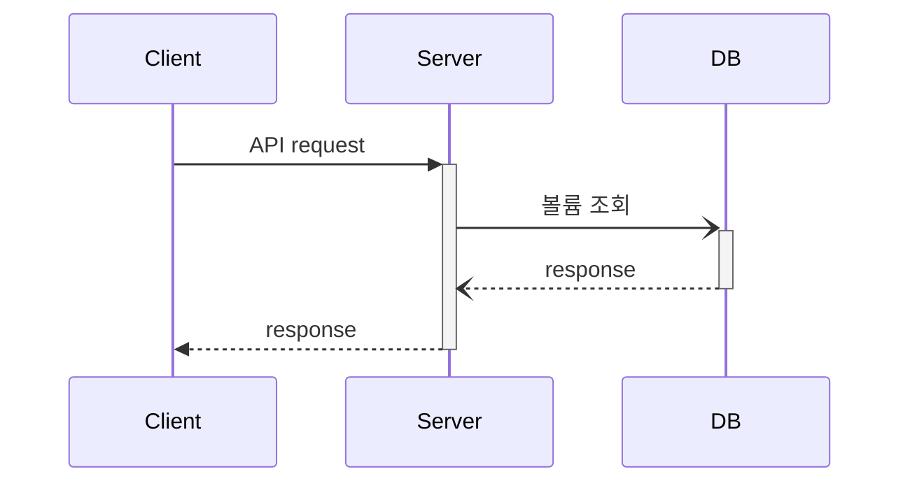
```mermaid
sequenceDiagram
    participant Client
    participant Server
    participant DB
    Client ->>+ Server: API request
    Server -)+ DB: 볼륨 조회
    DB --)- Server: response
    Server -->>- Client: response
```

### 단일 볼륨을 조회할 수 있다.

- 응답에는 반드시 다음 값이 필요하다.
    - ID
    - 이름
    - 설명
    - 프로젝트 ID
    - 볼륨 타입
    - 용량
    - 상태
    - 연결된 서버 ID, 이름
    - 생성일
    - 변경일
    - 삭제일

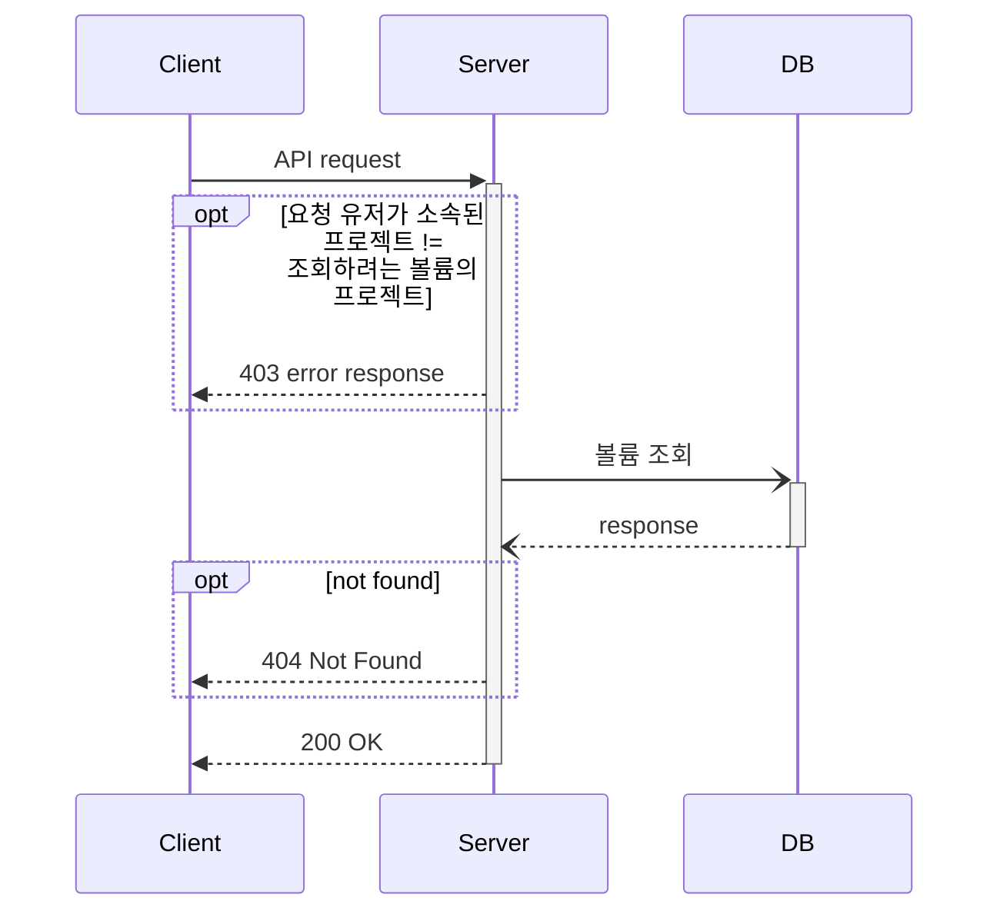
```mermaid
sequenceDiagram
    participant c as Client
    participant s as Server
    participant db as DB
    c ->>+ s: API request

    opt 요청 유저가 소속된 프로젝트 != 조회하려는 볼륨의 프로젝트
        s -->> c: 403 error response
    end

    s -)+ db: 볼륨 조회
    db --)- s: response

    opt not found
        s -->> c: 404 Not Found
    end
    s -->>- c: 200 OK
```

### 볼륨을 생성할 수 있다.

- 다음을 만족해야 한다.
    - 볼륨 이름은 프로젝트 내 삭제되지 않은 다른 볼륨 이름과 중복해서 생성할 수 없다.
    - 볼륨 타입은 `__DEFAULT__`로 고정한다.
- OpenStack
    - API 요청 성공 시, `creating` 상태로 volume 리소스 생성됨. 이후 성공적으로 생성이 완료되면 `available` 상태로 변경됨.

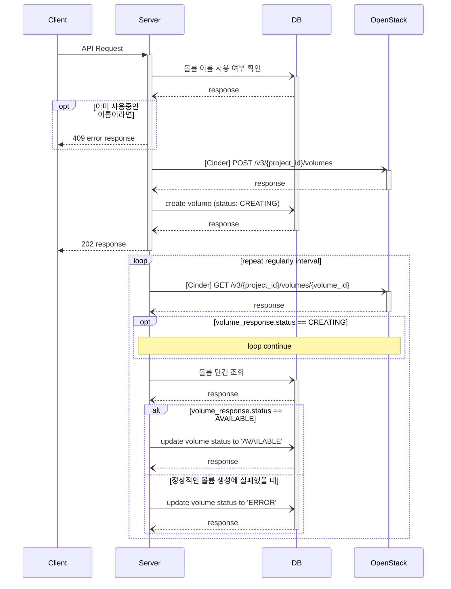
```mermaid
sequenceDiagram
    participant c as Client
    participant s as Server
    participant db as DB
    participant os as OpenStack
    c ->>+ s: API Request
    s -)+ db: 볼륨 이름 사용 여부 확인
    db --) s: response
    opt 이미 사용중인 이름이라면
        s -->> c: 409 error response
    end

    s -)+ os: [Cinder] POST /v3/{project_id}/volumes
    os --)- s: response
    s -) db: create volume (status: CREATING)
    db --)- s: response
    s -->>- c: 202 response

    loop repeat regularly interval
        s -)+ os: [Cinder] GET /v3/{project_id}/volumes/{volume_id}
        os --)- s: response

        opt volume_response.status == CREATING
            Note over s, os: loop continue
        end

        s -)+ db: 볼륨 단건 조회
        db --) s: response
        alt volume_response.status == AVAILABLE
            s -) db: update volume status to 'AVAILABLE'
            db --) s: response
        else 정상적인 볼륨 생성에 실패했을 때
            s -) db: update volume status to 'ERROR'
            db --)- s: response
        end
    end
```

### 볼륨을 변경할 수 있어야 한다.

- 다음을 만족해야 한다.
    - 볼륨 이름과 설명을 변경할 수 있다.
    - 볼륨 이름은 프로젝트 내 삭제되지 않은 다른 볼륨 이름과 중복할 수 없다.

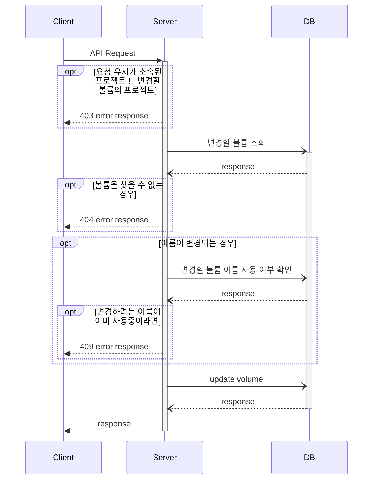
```mermaid
sequenceDiagram
    participant c as Client
    participant s as Server
    participant db as DB
    c ->>+ s: API Request

    opt 요청 유저가 소속된 프로젝트 != 변경할 볼륨의 프로젝트
        s -->> c: 403 error response
    end

    s -)+ db: 변경할 볼륨 조회
    db --) s: response
    opt 볼륨을 찾을 수 없는 경우
        s -->> c: 404 error response
    end

    opt 이름이 변경되는 경우
        s -) db: 변경할 볼륨 이름 사용 여부 확인
        db --) s: response
        opt 변경하려는 이름이 이미 사용중이라면
            s -->> c: 409 error response
        end
    end

    s -) db: update volume
    db --)- s: response
    s -->>- c: response
```

### 볼륨 용량을 변경할 수 있어야 한다.

- 볼륨 용량을 하향할 수 없다.
    - 볼륨 용량 상향을 실패했을 경우 보상 트랜잭션으로 다시 하향 시킬 수 없다.
- OpenStack
    - 용량 변경은 오직 `available` 상태일 때만 가능.
    - 볼륨 용량 변경 시, 기존 상태에서 `extending`으로 변경됨. 이후 변경이 완료되면 기존 상태로 다시 변경됨.

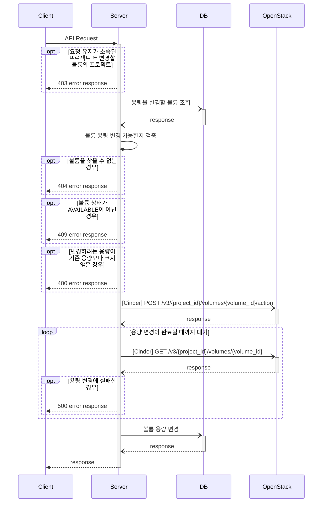
```mermaid
sequenceDiagram
    participant c as Client
    participant s as Server
    participant db as DB
    participant os as OpenStack
    c ->>+ s: API Request

    opt 요청 유저가 소속된 프로젝트 != 변경할 볼륨의 프로젝트
        s -->> c: 403 error response
    end

    s -)+ db: 용량을 변경할 볼륨 조회
    db --)- s: response
    s ->> s: 볼륨 용량 변경 가능한지 검증

    opt 볼륨을 찾을 수 없는 경우
        s -->> c: 404 error response
    end

    opt 볼륨 상태가 AVAILABLE이 아닌 경우
        s -->> c: 409 error response
    end

    opt 변경하려는 용량이 기존 용량보다 크지 않은 경우
        s -->> c: 400 error response
    end

    s -)+ os: [Cinder] POST /v3/{project_id}/volumes/{volume_id}/action
    os --)- s: response

    loop 용량 변경이 완료될 때까지 대기
        s -)+ os: [Cinder] GET /v3/{project_id}/volumes/{volume_id}
        os --)- s: response

        opt 용량 변경에 실패한 경우
            s -->> c: 500 error response
        end
    end

    s -)+ db: 볼륨 용량 변경
    db --)- s: response
    s -->>- c: response
```

### 볼륨을 삭제할 수 있어야 한다.

- 다음을 만족해야 한다.
    - 볼륨은 삭제 가능한 상태에서만 삭제할 수 있다.
    - 서버에 연결한 볼륨은 삭제할 수 없다. (해제 후 삭제는 가능하다)

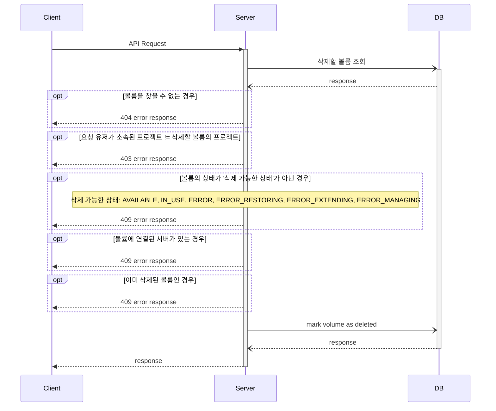
```mermaid
sequenceDiagram
    participant c as Client
    participant s as Server
    participant db as DB
    c ->>+ s: API Request
    s -)+ db: 삭제할 볼륨 조회
    db --) s: response

    opt 볼륨을 찾을 수 없는 경우
        s -->> c: 404 error response
    end
    opt 요청 유저가 소속된 프로젝트 != 삭제할 볼륨의 프로젝트
        s -->> c: 403 error response
    end
    opt 볼륨의 상태가 '삭제 가능한 상태'가 아닌 경우
        Note over s: 삭제 가능한 상태: AVAILABLE, IN_USE, ERROR, ERROR_RESTORING, ERROR_EXTENDING, ERROR_MANAGING
        s -->> c: 409 error response
    end
    opt 볼륨에 연결된 서버가 있는 경우
        s -->> c: 409 error response
    end
    opt 이미 삭제된 볼륨인 경우
        s -->> c: 409 error response
    end

    s -) db: mark volume as deleted
    db --)- s: response
    s -->>- c: response
```

## **Floating IP**

### 소유한 플로팅 IP 목록을 조회할 수 있어야 한다.

- 정렬 조건
    - 주소
    - 생성일
- 응답에는 반드시 다음 값이 필요하다.
    - ID
    - IP 주소
    - 프로젝트 ID
    - 상태
    - 연결된 서버 ID, 이름
    - 생성일
    - 변경일
    - 삭제일

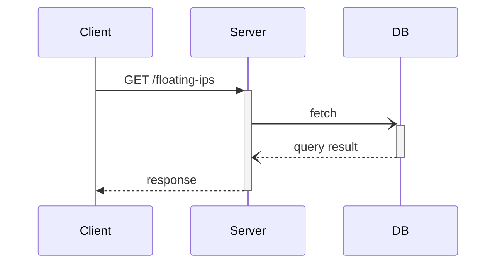
```mermaid
sequenceDiagram
    participant Client
    participant Server
    participant DB
    Client ->>+ Server: GET /floating-ips
    Server -)+ DB: fetch
    DB --)- Server: query result
    Server -->>- Client: response
```

### 단일 플로팅 IP 를 조회할 수 있어야 한다.

- 응답에는 반드시 다음 값이 필요하다.
    - ID
    - IP 주소
    - 프로젝트 ID
    - 상태
    - 연결된 서버 ID, 이름
    - 생성일
    - 변경일
    - 삭제일

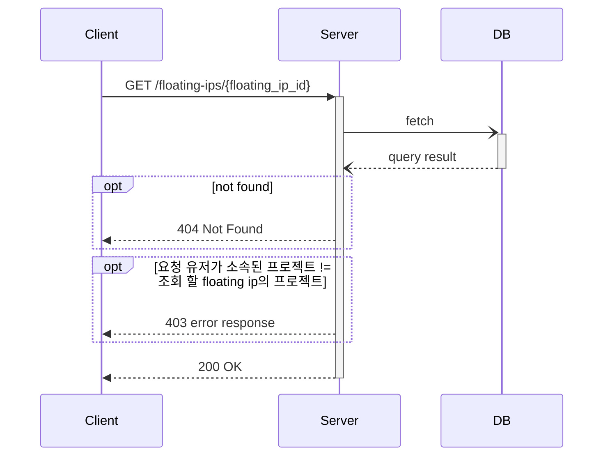
```mermaid
sequenceDiagram
    participant Client
    participant Server
    participant DB
    Client ->>+ Server: GET /floating-ips/{floating_ip_id}
    Server -)+ DB: fetch
    DB --)- Server: query result

    opt not found
        Server -->> Client: 404 Not Found
    end

    opt 요청 유저가 소속된 프로젝트 != 조회 할 floating ip의 프로젝트
        Server -->> Client: 403 error response
    end

    Server -->>- Client: 200 OK
```

### 플로팅 IP 를 할당 받을 수 있어야 한다.

- 사전 제공 받은 Public network 에서 할당 받을 수 있다.

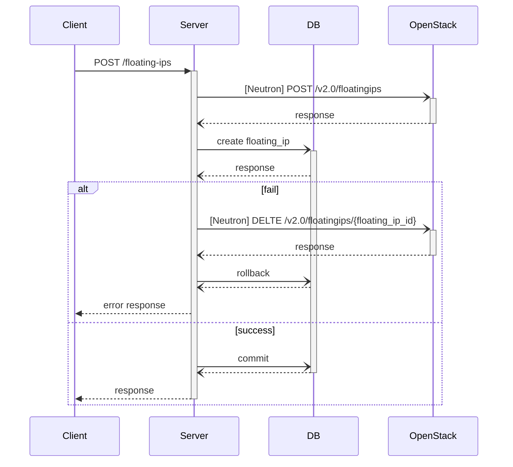
```mermaid
sequenceDiagram
    participant c as Client
    participant s as Server
    participant db as DB
    participant neutron as OpenStack
    c ->>+ s: POST /floating-ips
    s -)+ neutron: [Neutron] POST /v2.0/floatingips
    neutron --)- s: response
    s -)+ db: create floating_ip
    db --) s: response


alt fail
s-)+neutron: [Neutron] DELTE /v2.0/floatingips/{floating_ip_id}
neutron--)-s: response
s-)db: rollback
db--)s: 
          s-->>c: error response
else success
s-)db: commit
db--)-s:
s-->>-c: response
end
```

### 플로팅 IP 를 할당 해제(삭제)할 수 있어야 한다.

- 서버에 할당한 경우 삭제할 수 없다.

```mermaid
sequenceDiagram
    participant c as Client
    participant s as Server
    participant db as DB
    c ->>+ s: DELETE /floating-ips/{floating_ip_id}
    s -)+ db: floating ip 존재 확인
    db --) s: response
    opt floating ip 없음
        s -->> c: 404 error response
    end

    opt 요청 유저가 소속된 프로젝트 != 삭제할 floating ip의 프로젝트
        s -->> c: 403 error response
    end

    s -) db: 서버 할당 여부 확인
    db --) s: response
    opt 서버에 연결된 경우
        s -->> c: 409 error response
    end

    s ->> s: soft delete
    s -) db: security group update
    db --)- s: response
    s -)+ neutron: [Neutron] DELETE /v2.0/floatingips/{floating_ip_id}
    neutron --)- s: response
    s -->>- c: response
```

## **보안 그룹**

### 소유한 보안 그룹 목록을 조회할 수 있다.

- 정렬 조건
    - 이름
    - 생성일
- 응답에는 반드시 다음 값이 필요하다.
    - ID
    - 이름
    - 설명
    - 프로젝트 ID
    - 룰셋 프로토콜, Direction, 시작 포트, 종료 포트, CIDR
    - (연결한 서버 ID, 이름)
    - 생성일
    - 변경일
    - 삭제일

```mermaid
sequenceDiagram
    participant Client
    participant Server
    participant DB
    participant neutron as OpenStack
    Client ->>+ Server: GET /security-groups
    Server -)+ DB: 보안그룹 리스트 조회
    DB --)- Server: response
    Server -)+ neutron: [Neutron] GET /v2.0/security-group-rules
    neutron --)- Server: response
    Server -->>- Client: response
```

### 단일 보안 그룹을 조회할 수 있어야 한다.

- 응답에는 반드시 다음 값이 필요하다.
    - ID
    - 이름
    - 설명
    - 프로젝트 ID
    - 룰셋 프로토콜, Direction, 시작 포트, 종료 포트, CIDR
    - (연결한 서버 ID, 이름)
    - 생성일
    - 변경일
    - 삭제일

```mermaid
sequenceDiagram
    participant Client
    participant Server
    participant DB
    participant neutron as OpenStack
    Client ->>+ Server: GET /security-groups/{security_group_id}
    Server -)+ DB: 보안 그룹 조회
    DB --)- Server: response

    opt not found
        Server -->> Client: 404 Not Found
    end

    opt 요청 유저가 소속된 프로젝트 != 조회할 보안 그룹의 프로젝트
        Server -->> Client: 403 error response
    end

    Server -)+ neutron: [Neutron] GET /v2.0/security-group-rules
    neutron --)- Server: response
    Server -->>- Client: 200 OK
```

### 보안 그룹을 생성할 수 있어야 한다.

- 다음 조건을 만족해야 한다.
    - 보안 그룹 이름은 프로젝트 내 삭제되지 않은 다른 보안 그룹 이름과 중복해서 생성할 수 없다.
    - 보안 그룹 룰셋들을 설정해 생성할 수 있어야 한다.

```mermaid
sequenceDiagram
    participant c as Client
    participant s as Server
    participant db as DB
    participant neutron as OpenStack
    c ->>+ s: POST /security-groups
    s -)+ db: 이름 중복 확인
    db --) s: response
    opt 이름 중복
        s -->> c: 409 error response
    end

    s -)+ neutron: [Neutron] POST /v2.0/security-groups
    neutron --)- s: response
    s -) db: 보안 그룹 생성
    db --) s: response
    s -)+ neutron: [Neutron] POST /v2.0/security-group-rules
    neutron --)- s: response

alt fail
s-)+neutron: [Neutron] DELTE /v2.0/security-groups/{security_group_id}
neutron--)-s: response
s-)db: rollback
db--)s: 
          s-->>c: error response
else success
s-)db: commit
db--)-s:
s-->>-c: response
end
```

### 보안 그룹을 변경할 수 있어야 한다.

- 다음 조건을 만족해야 한다.
    - 보안 그룹 이름과 설명을 변경할 수 있다.
    - 보안 그룹 이름은 자신이 소유한 다른 보안 그룹 이름과 중복할 수 없다.
    - 보안 그룹 룰셋들을 한 번에 여러 개 변경할 수 있어야 한다.

```mermaid
sequenceDiagram
    participant c as Client
    participant s as Server
    participant db as DB
    participant neutron as OpenStack
    c ->>+ s: PUT /security-groups/{security_group_id}
    s -)+ db: 보안그룹 조회
    db --) s: response
    opt 보안그룹 없음
        s -->> c: 404 error response
    end

    opt 요청 유저가 소속된 프로젝트 != 변경할 보안 그룹의 프로젝트
        s -->> c: 403 error response
    end

    s -) db: 이름 중복 확인
    db --) s: response
    opt 이름 중복
        s -->> c: 409 error response
    end

    s -) db: 보안 그룹 정보 업데이트
    db --) s: response
    s -)+ neutron: [Neutron] PUT /v2.0/security-groups/{security_group_id}
    neutron --)- s: response
    s -)+ neutron: [Neutron] GET /v2.0/security-group-rules
    neutron --)- s: response

    loop 삭제할 룰셋 삭제
        s ->>+ neutron: [Neutron] DELETE /v2.0/security-group-rules/{security_group_rule_id}
        neutron --)- s: responses
    end

    s -)+ neutron: [Neutron] POST /v2.0/security-group-rules
    neutron --)- s: response

alt fail
Note over s, neutron: OpenStack 보상트랜잭션 발행
s-)db: rollback
db--)s: 
          s-->>c: error response
else success
s-)db: commit
db--)-s:
s-->>-c: response
end
```

### 보안 그룹을 삭제할 수 있어야 한다.

- 다음 조건을 만족해야 한다.
    - 연결된 서버가 존재하는 경우 보안그룹을 삭제할 수 없다.

```mermaid
sequenceDiagram
    participant c as Client
    participant s as Server
    participant db as DB
    c ->>+ s: DELETE /security-groups/{security_group_id}
    s -)+ db: 보안 그룹 존재 확인
    db --) s: response
    opt 보안 그룹 없음
        s -->> c: 404 error response
    end

    opt 요청 유저가 소속된 프로젝트 != 삭제할 보안그룹의 프로젝트
        s -->> c: 403 error response
    end

    s -) db: 연결된 서버 존재 확인
    db --) s: response
    opt 연결된 서버 존재
        s -->> c: 409 error response
    end

    s ->> s: soft delete
    s -) db: security group update
    db --)- s: response
    s -)+ neutron: [Neutron] DELETE /v2.0/security-groups/{security_group_id}
    neutron --)- s: response
    s -->>- c: response
```